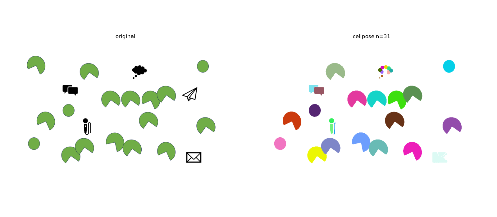
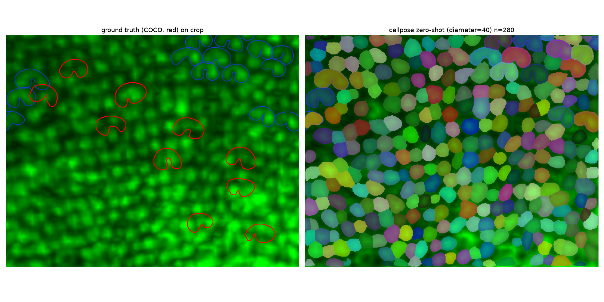

# Cellpose を用いた馬蹄形検出（検証中）

蛍光顕微鏡画像から馬蹄形（horseshoe）構造を検出するための、[Cellpose](https://github.com/MouseLand/cellpose) を使った代替パイプラインの検証用フォルダ。
`Detectron2/` の Mask R-CNN パイプラインとは別アプローチとして、実データで実際に動かして検証した結果をまとめている。

## Cellpose とは

Cellpose は Janelia/HHMI（Stringer, Pachitariu ら）が開発した、蛍光顕微鏡画像向けの汎用インスタンスセグメンテーションモデル。

- **非凸形状に強い**: 各ピクセルから中心へ向かう勾配場（flow field）を予測し、勾配追跡でピクセルをインスタンスにまとめる方式のため、円形を仮定するwatershed系の手法と違い、馬蹄形のような凹形状・三日月形も自然に扱える。バウンディングボックス提案に依存する Mask R-CNN より、密集した非凸オブジェクトの分離に向いている。
- **汎用の事前学習モデル**: 蛍光顕微鏡・明視野など多様なデータで学習済みの汎用モデルがあり、ゼロショット（再学習なし）でもある程度動く。
- **Cellpose-SAM (v4系)**: 2025年に発表された最新世代で、Segment Anything Model のバックボーンを使い「単一の汎用モデルで細胞種・撮影条件を問わず高精度」を謳う（`cpsam_v2`）。本検証はこのバージョン（`cellpose==4.2.1.1`）を使用。
- **Human-in-the-loopでの再学習**: 少数の手動修正データを使った転移学習（fine-tuning）が公式にサポートされており、GUIで「ゼロショット推論→誤りを手動修正→再学習」のループを回せる。

### Detectron2 (Mask R-CNN) との比較

| | Detectron2 (Mask R-CNN) | Cellpose |
|---|---|---|
| 形状の仮定 | バウンディングボックス提案 + マスク回帰 | ピクセル単位のflow場（非凸形状に強い） |
| ゼロショット性能 | ほぼ不可（要学習） | 汎用モデルである程度動く |
| 再学習の手間 | COCOアノテーション + フル学習 | 少数データでのfine-tuningが公式サポート |
| 密集オブジェクトの分離 | NMSに依存 | flow場による分離が得意 |

## 検証結果（実際に動かして確認した内容）

`cellpose==4.2.1.1` を CPU 環境（GPUなし）にインストールし、このリポジトリの実データで検証した。

### 1. 概念実証: 凹形状（馬蹄形）の分離精度

`Detectron2/simpledataset/images/003.png`（馬蹄形〈Pac-Man状〉アイコンと無関係の黒アイコンが混在する合成画像、Detectron2のブートストラップ用データセット）にゼロショットの `cpsam_v2` をそのまま適用。



- 重なり合う複数の馬蹄形アイコンも個別インスタンスとして正しく分離。
- 凹み（ノッチ）の形状も保持したままマスク化できている。
- 無関係の黒アイコン（吹き出し、封筒など）も概ね誤検出なく無視、または別インスタンスとして分離。

→ **馬蹄形のような非凸形状の検出・分離自体は、追加学習なしでも十分な精度が出ることを確認。**

### 2. 実データでの検証: スケールが重要

実際の蛍光画像 `pic/up_Fz_green_stronger_selected_2_blue.tif`（2508×1248、`Detectron2/annotations/train_annotations_horseshoe.json` の `001.tif` と同一寸法・同一データと思われる）で検証。

このJSONの正解アノテーション（`image_id=0`, 10インスタンス）は、幅平均49px・高さ平均35pxの小さな三日月状構造。これを画像に重ねると、組織全体に同様の三日月状テクスチャが密に存在し、その中から特定の条件を満たすごく一部だけが "horseshoe" としてラベル付けされていることが分かった。



- 左: 正解アノテーション（赤=horseshoe、青=画像に元々あった別の手動マーキング）
- 右: `diameter=40`（正解の平均サイズに合わせた値）でのゼロショット検出結果

`diameter` を正解サイズに合わせることで、個々の三日月状構造をほぼ1:1のスケールで検出できている（このクロップ内で280インスタンス検出）。一方で `diameter=None`（自動推定）のままだと、もっと粗いスケール（組織のグリッド単位、742インスタンス）を拾ってしまい、意図したスケールにならない。

→ **重要な発見**: このプロジェクトの「horseshoe」は、画像全体に均一に存在する三日月状組織テクスチャの中から**特定の基準を満たすサブセットを選び出す分類問題**に近い。Cellpose のゼロショットモデルは正しいスケールでの形状検出は得意だが、「どれが真のhorseshoeか」という選別基準までは知らない。ここは Detectron2 パイプラインで少数データを学習させているのと同様、**fine-tuningが必要**。

## ファイル構成

```
Cellpose/
├── inference_test.py            # 事前学習/fine-tuning済みモデルによる検出テスト
├── estimate_diameter.py         # COCOアノテーションから推奨diameterを算出
├── dataset_prepare_from_coco.py # 既存のDetectron2用COCOアノテーションをCellpose形式に変換
├── train_finetune.py            # 変換したデータでcpsam_v2をCLIでfine-tuning（loss/TensorBoard記録付き）
├── launch_gui.py                # Cellpose GUI起動（human-in-the-loop fine-tuning用）
├── func/
│   └── vd_split.py              # V-D（左右）分割・輝度計算（Detectron2/func/と同ロジック）
├── results/                     # 検証結果の画像（本README用）
└── requirements.txt
```

## 環境構築

```bash
pip install -r requirements.txt
```

初回推論時に `cpsam_v2` の重み（約1.15GB）が `~/.cellpose/models` に自動ダウンロードされる。

## 使い方

### 0. diameterの推定（推奨・初回のみ）

「検証結果」の通り、Cellposeの検出精度は `diameter` を対象の実サイズに合わせられるかに大きく依存する。
毎回目視・手計算する代わりに、既存のCOCOアノテーションから機械的に推奨値を算出できる。

```bash
python estimate_diameter.py --coco ../Detectron2/annotations/train_annotations_horseshoe.json
```

```
インスタンス数: 85
等価直径(2*sqrt(area/pi)) 平均: 35.5px  (min=3.4, max=46.1)
bbox幅 平均: 46.9px, bbox高さ 平均: 34.0px

推奨: python inference_test.py --diameter 35 ...
```

### 1. ゼロショットでの動作確認

```bash
# デフォルト: pic/ 内のTIFF（あれば）、無ければ合成データにフォールバック
python inference_test.py

# 画像とdiameterを指定（上記0.の推奨値、または実データでは40前後を推奨。「検証結果」参照）
python inference_test.py --image ../pic/up_Fz_green_stronger_selected_2_blue.tif --diameter 40

# GPU使用時
python inference_test.py --gpu --diameter 40

# flow_threshold/cellprob_thresholdで検出の厳しさを調整
# （組織テクスチャ由来の誤検出を絞り込みたい場合はflow_thresholdを下げる）
python inference_test.py --diameter 40 --flow-threshold 0.2 --cellprob-threshold 0.5
```

結果は `./output/<画像名>_cellpose_test.png` に保存される。V-D分割（緑色領域の中心を境にした左右分割）と各側の平均輝度もコンソールに出力される。

### 2. 既存アノテーションをCellpose形式に変換

Detectron2用に作成済みのCOCOアノテーション（`Detectron2/annotations/*.json`）をそのまま再利用できる。新規アノテーションは不要。

```bash
python dataset_prepare_from_coco.py \
    --coco ../Detectron2/annotations/train_annotations_horseshoe.json \
    --images-dir ../data/train/images \
    --out-dir ./cellpose_dataset/train

python dataset_prepare_from_coco.py \
    --coco ../Detectron2/annotations/val_annotations_horseshoe.json \
    --images-dir ../data/val/images \
    --out-dir ./cellpose_dataset/test
```

### 3. Fine-tuning

```bash
python train_finetune.py \
    --train-dir ./cellpose_dataset/train \
    --test-dir ./cellpose_dataset/test \
    --n-epochs 100 \
    --gpu
```

`--n-epochs 2` の小規模データでの動作確認は実施済み（1画像・10インスタンスで学習ジョブが完走し、モデルファイルが `output/models/` に保存されることを確認）。実運用では十分な枚数・エポック数で学習すること。

学習済みモデルは以下で読み込める:

```python
from cellpose import models
model = models.CellposeModel(pretrained_model="./output/models/horseshoe_cpsam", gpu=True)
```

#### 学習の監視（loss / learning rate）

学習完了時に `--save-path`（デフォルト `./output`）以下へ以下を出力する。

| ファイル | 内容 |
|---------|------|
| `<model_name>_loss_history.csv` | epochごとのtrain_loss / test_loss |
| `<model_name>_loss_curve.png` | 上記のプロット画像 |
| `tensorboard/<model_name>/` | TensorBoard用ログ（loss/train, loss/test, learning_rate） |

TensorBoardで確認する場合:

```bash
tensorboard --logdir ./output/tensorboard
```

見るべき点は `Detectron2/tensorboard/README.md` と同様:
- **train_loss / test_loss が下がっているか**: 順調に学習が進んでいればepochごとに減少する。
- **収束しているか**: 途中から横ばいになれば、それ以上 `--n-epochs` を増やしても効果は薄い。
- **test_lossだけ途中から増加（過学習）**: train_lossは下がり続けるがtest_lossが増加に転じた場合、
  そのepoch付近のモデルの方が汎化性能は高い可能性がある。学習データを増やすか `--n-epochs` を減らして再学習する。
- **振動（スパイク）**: `--learning-rate` が高すぎる可能性がある（デフォルト `1e-5` を下げてみる）。

なお `learning_rate` はTensorBoardに定数として記録しているだけで、Cellpose内部の動的なスケジュール自体を
可視化しているわけではない（`train.train_seg()` は公開APIとして学習率スケジュールを返さないため）。
複数の学習率を比較したい場合は `--model-name` を変えて複数回実行し、TensorBoard上で並べて比較する。

### 4. GUIでのfine-tuning（human-in-the-loop）

`train_finetune.py`（CLIで一括学習）とは別に、Cellpose公式GUIを使うと
「ゼロショット推論 → マスクを手動修正 → その場でfine-tuning」のループを
インタラクティブに回せる。**検証結果（2.実データでの検証）から、この
プロジェクトの"horseshoe"は密なテクスチャの中の特定サブセットの選別が
必要なため、GUIでの少数サンプル修正によるfine-tuningは特に有効な可能性が高い。**

GUIの起動・手動修正・学習実行はディスプレイのある環境での操作が必要なため、
本リポジトリでは起動スクリプトと事前準備（既存アノテーションの変換）までを用意している。
実行・精度検証はユーザー側で行うこと。

```bash
# GUI依存パッケージのインストール（初回のみ）
pip install "cellpose[gui]"

# (推奨) 既存のCOCOアノテーションを変換しておくと、GUIで画像を開いた際に
# "Autoload masks from _masks.tif file" を有効にするだけで変換済みマスクを
# 初期状態として読み込める（ゼロから手動アノテーションし直さずに済む）
python dataset_prepare_from_coco.py \
    --coco ../Detectron2/annotations/train_annotations_horseshoe.json \
    --images-dir ../data/train/images \
    --out-dir ./cellpose_dataset/train

# GUI起動（--imageは省略可、GUI内から開いてもよい）
python launch_gui.py --image ./cellpose_dataset/train/001.png
```

GUI内での操作手順（詳細は `launch_gui.py` のdocstringにも記載）:

1. File > *Load image* で画像を開く（`--image`指定時は自動で開かれる）
2. File > *Autoload masks from _masks.tif file* を有効にしておくと、変換済みマスクが自動読込される
3. 誤検出・見逃しをブラシ/右クリック削除で手動修正し、`Ctrl+S` で保存（`<画像名>_seg.npy` として保存）
4. 同じフォルダ内の複数画像で 1-3 を繰り返す（`_seg.npy` が学習データになる）
5. Models > *Train new model with image+masks in folder* を実行し、ダイアログで
   `learning_rate` / `n_epochs` / `model_name` を設定して学習開始
   （GUIは学習中にtrain/test lossの推移をウィンドウ内にリアルタイム表示する。急激な発散や
   0付近での停滞が見えたら、`learning_rate` を下げる/上げるかサンプル数を見直す）
6. 学習後のモデルは `<フォルダ>/models/<model_name>` に保存され、GUIのモデル一覧にも自動追加される
7. 保存されたモデルは以下でCLIからも利用できる:
   ```bash
   python inference_test.py --image <画像> --pretrained-model ./cellpose_dataset/train/models/<model_name>
   ```
   CLIの `train_finetune.py` と違い、GUI経由の学習では loss_history.csv / TensorBoardログは
   自動生成されない（GUI内のリアルタイム表示のみ）。学習後にCSV等で振り返りたい場合は、
   同じデータで `train_finetune.py --model-name <同じ名前>` を実行し直すとよい。

## 今後の課題

- **本格的なfine-tuning**: 現状 `Detectron2/annotations/` にある85インスタンス（4画像）分のアノテーションで学習は可能だが、精度検証にはより多くのデータが必要。
- **GUIでの human-in-the-loop の実運用**: 起動スクリプト・データ変換までは用意済み。実際の手動修正・学習・精度検証は未実施。
- **V-D分割ロジックの共通化**: 現在 `func/vd_split.py` は `Detectron2/func/` の緑色HSV抽出ロジックを踏襲しているが、実データでの精度検証は未実施。
- **「真のhorseshoe」選別の自動化**: `estimate_diameter.py` によるスケール合わせ、`inference_test.py` の
  `--flow-threshold` / `--cellprob-threshold` による絞り込みまでは実装済みだが、それでも残る
  組織テクスチャ由来の誤検出をどう除外するか（形状の凹み具合でのフィルタリング等）は未検証。
- **fine-tuning後の`--flow-threshold`/`--cellprob-threshold`再チューニング**: これらの閾値の最適値は
  ゼロショット時と学習後で変わりうるため、fine-tuning後のモデルで改めて検証用データに対し調整が必要。
